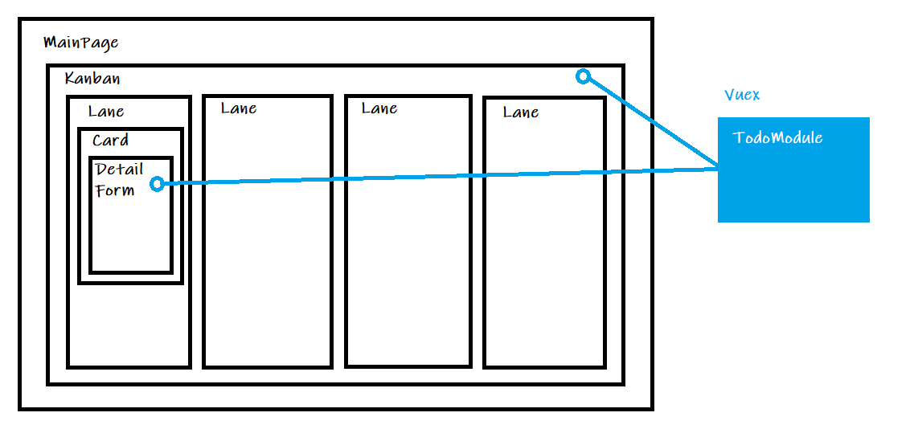

# TodoSample

## Structure

以下の構成になっています。

- MainPage: ページに何のコンポーネントを表示させるか管理（Kanbanとか）
- Kanban: かんばんに何を表示させるか管理（Todo, Doing, Review, DoneとかのLane）
- Lane: レーンに何のカードを表示させるか管理
- Card: カードの機能を管理（タイトル表示、カードクリック時の詳細表示とか）





## Project setup

```
npm install
```

### Compiles and hot-reloads for development
```
npm run serve
```

### Compiles and minifies for production
```
npm run build
```

### Run your tests
```
npm run test
```

### Lints and fixes files
```
npm run lint
```

### Customize configuration
See [Configuration Reference](https://cli.vuejs.org/config/).
